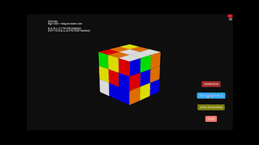

# Rubik's Cube Simulation



This is an interactive, 3D simulation of a Rubik's Cube. It is written in Python using the Ursina game engine.
The simulation is fully playable, and includes a solver that can solve any valid permutation of a Rubik's Cube.
The simulation uses the beginner's method to solve the cube and a third-party implementation of the Kociemba algorithm to solve the cube.

## Installation
Make sure you have Python 3.6 or higher installed. You can download Python [here](https://www.python.org/downloads/).
You will also need to install the Ursina game engine and kociemba solving algorithm. You can do this by running the following command in your terminal:
```
pip install -r requirements.txt
```
